# corner_intersection シナリオ結果まとめ

## 概要
- 対象シナリオ: corner_intersection（3基地局、C_b=10）
- 対象サンプル: 61タイムスタンプ、車両タイムサンプル 4,123（ユニーク車両数 100、タイムスタンプ当たり平均 67.6 台）
- 候補生成の規模: 73,563候補（Direct 12,369 / Relay 61,194）
  - 1車両あたり候補数は平均 17.8（中央値 18）で、Directは複数BS候補、Relayは近傍車経由の候補を含む
- 評価指標
  - Throughput評価は MCS ベースの実効スループット（アウトエージは 0 Mbps）
  - Outage率、P05/P50/P95、平均スループット、Relay率を併用して比較

## 比較対象（論文向けの説明）
### Random割当
各車両が候補からランダムに接続アクションを選択し、基地局容量超過時はランダムに落選する。制約は満たすが性能は下限のベースライン。

### Greedy（グローバル）
候補全体をスループット降順で並べ、車両1本制約と基地局容量制約を満たす限り順に採択する。局所的な欲張りだが、探索範囲は全体。

### Optimal MCS（上界ベースライン）
MCSベースのスループットを目的関数として、車両1本制約と基地局容量制約を満たす割当を整数最適化で解く。MCS評価に対して整合性のある上界に相当。

### Proposed（D/K×MCS）
Direct/Relayでリンク種別に応じたマージンを適用し、MCS推定値で最適化する方法。評価はMCS実効値で行う。

### 目的関数
- T: Throughput最大化（総スループット最大）
- O: Outage最小化（救済数最大化 + その条件下でスループット最大化）

## 結果（T: Throughput最適化）
### 定量結果
| Method | Outage率 | Mean [Mbps] | P05 | P50 | P95 | Relay率 |
| --- | --- | --- | --- | --- | --- | --- |
| random | 0.704 | 162.105 | 0.000 | 0.000 | 550.000 | 0.048 |
| greedy_mcs | 0.263 | 402.755 | 0.000 | 550.000 | 550.000 | 0.815 |
| optimal_mcs | 0.000 | 547.279 | 550.000 | 550.000 | 550.000 | 0.845 |
| proposed_optimal_dkmcs | 0.000 | 546.478 | 550.000 | 550.000 | 550.000 | 0.886 |

### 主要な観察
- GreedyはRandomに比べて大幅改善（Outage率 0.704 → 0.263、Mean 162 → 403）だが、依然として4台に1台程度が落選。
- Optimal MCSとProposedはどちらもOutage率0で、平均スループットはほぼ上限（~547 Mbps）に到達。
  - ProposedはOptimal MCSより平均が約0.8 Mbps低いが、Relay率は高い。D/KマージンによりDirectよりRelay選択が増えたと解釈できる。
- スループット分布は二極化（0と高MCS）になりやすく、Greedyは0スループットの塊をまだ多く含む。

### 図（T）
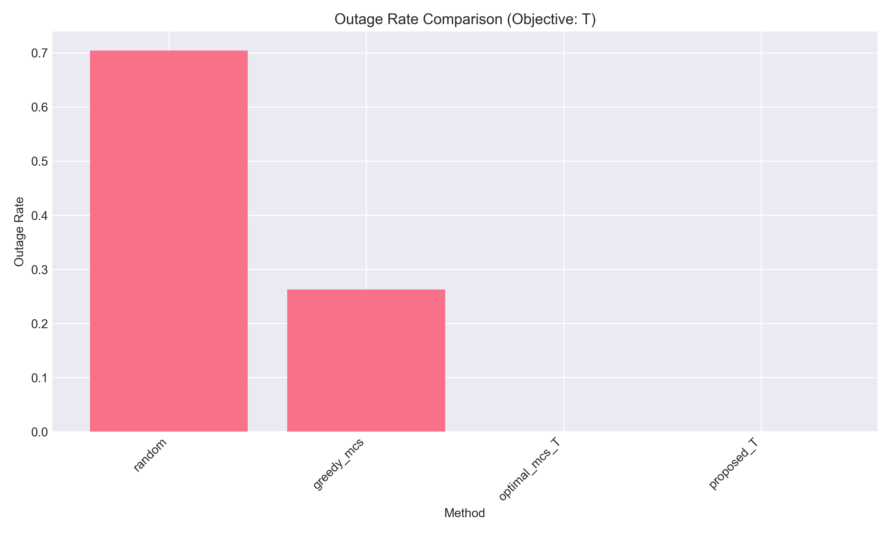
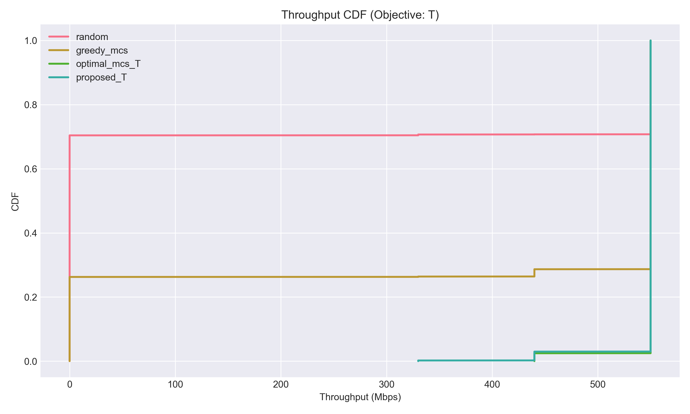
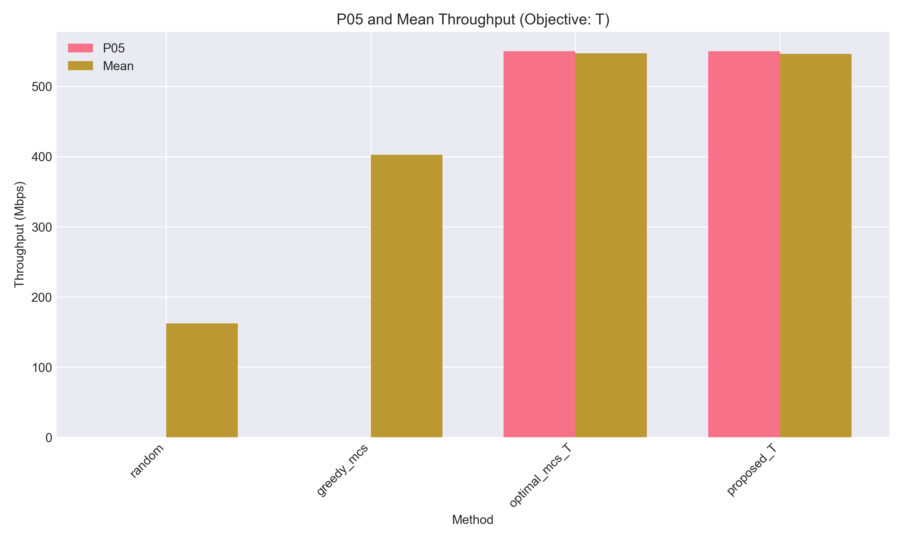
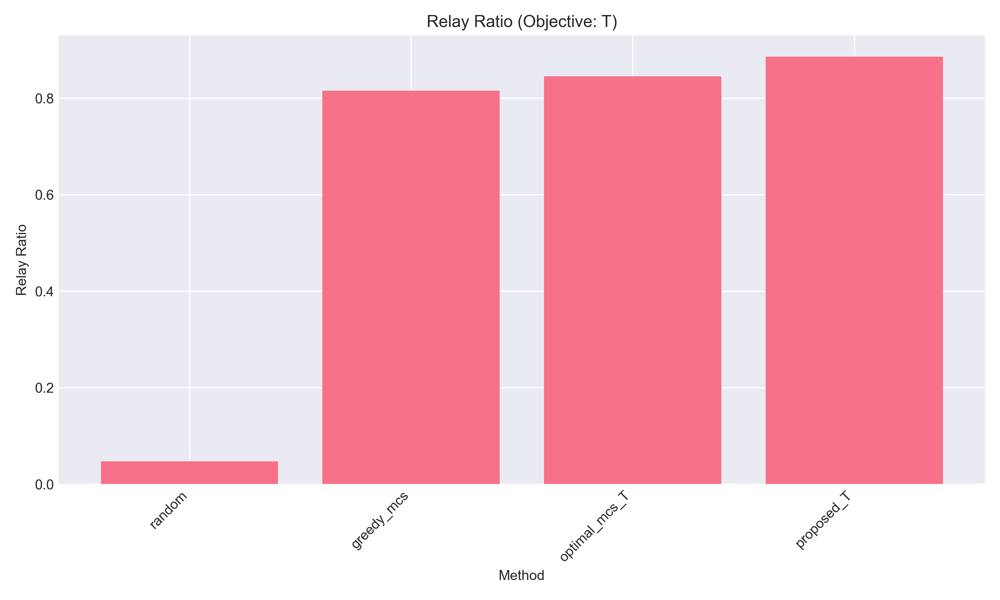
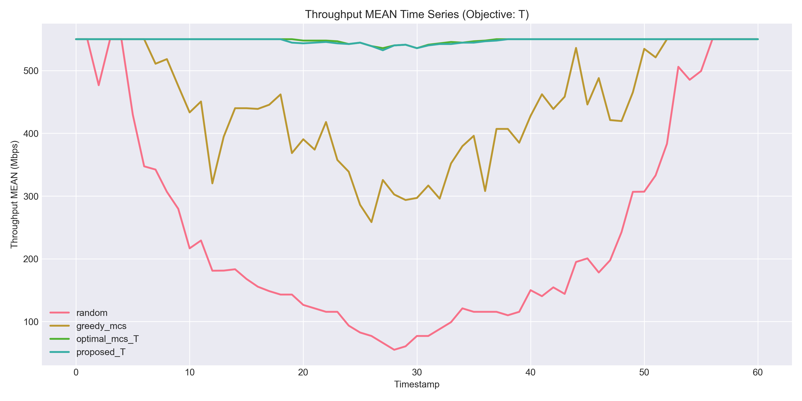
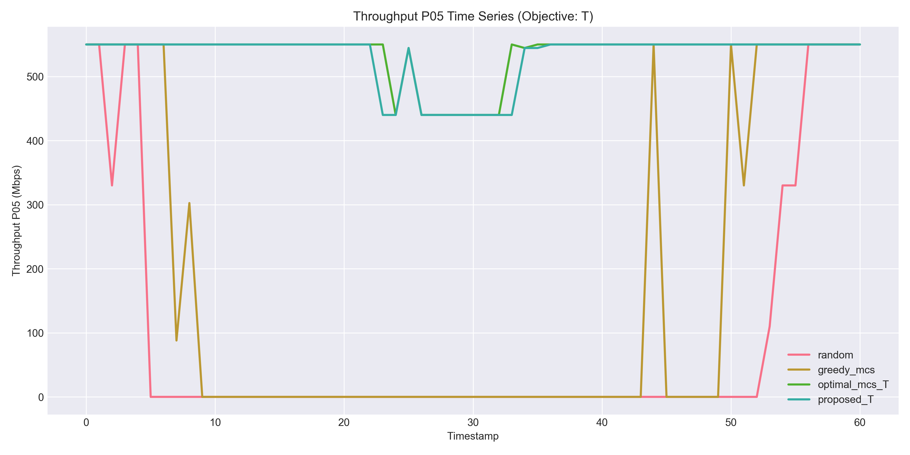

### 時系列の安定性（T）
- タイムスタンプ平均スループットのレンジ:
  - random: 55.0–550.0 Mbps
  - greedy_mcs: 258.5–550.0 Mbps
  - optimal_mcs: 535.7–550.0 Mbps
  - proposed_optimal_dkmcs: 532.4–550.0 Mbps
- P05の最小値:
  - random/greedy_mcsは 0 Mbps（アウトエージの影響が強い）
  - optimal_mcs/proposed は 440 Mbps（低位の時刻でも高水準を維持）

## 結果（O: Outage最小化）
### 定量結果
| Method | Outage率 | Mean [Mbps] | P05 | P50 | P95 | Relay率 |
| --- | --- | --- | --- | --- | --- | --- |
| random | 0.704 | 162.105 | 0.000 | 0.000 | 550.000 | 0.048 |
| greedy_mcs | 0.263 | 402.755 | 0.000 | 550.000 | 550.000 | 0.815 |
| optimal_mcs | 0.000 | 547.279 | 550.000 | 550.000 | 550.000 | 0.865 |
| proposed_optimal_dkmcs | 0.000 | 546.425 | 550.000 | 550.000 | 550.000 | 0.901 |

### 主要な観察
- Optimal MCS/ProposedはTと同じくOutage率0で、O目的によるスループット低下はほぼない。
- O目的ではRelay率がわずかに上昇（Optimal MCS: 0.845→0.865、Proposed: 0.886→0.901）。
  - 「救済数最大化」を優先するため、Directより安定なRelayを増やす傾向が出ている。
- このシナリオでは、T目的でも全車両救済が可能なため、O目的との差がほぼ出ない。

### 図（O）
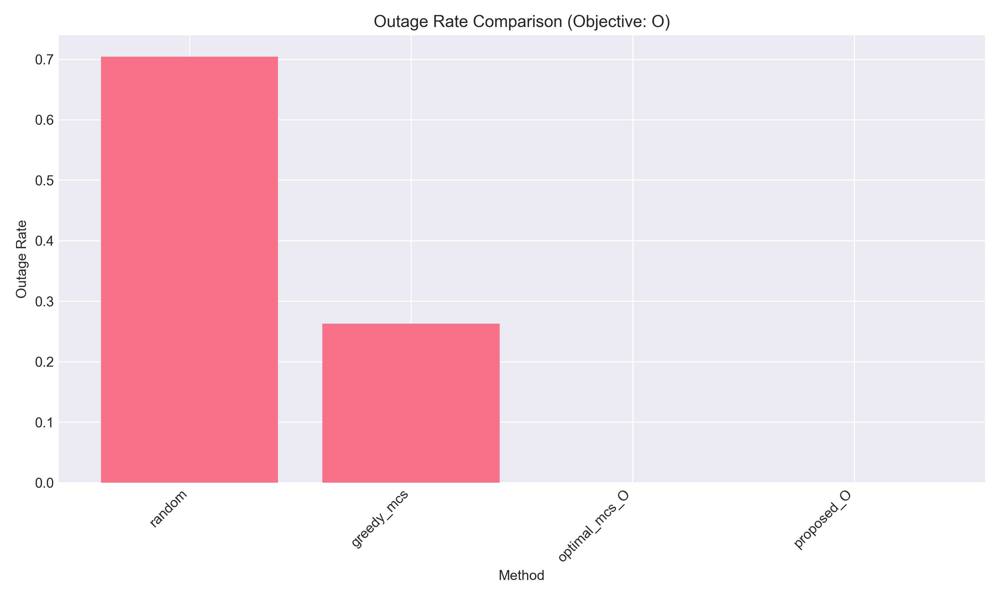

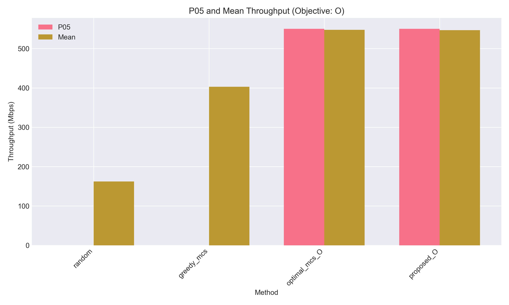
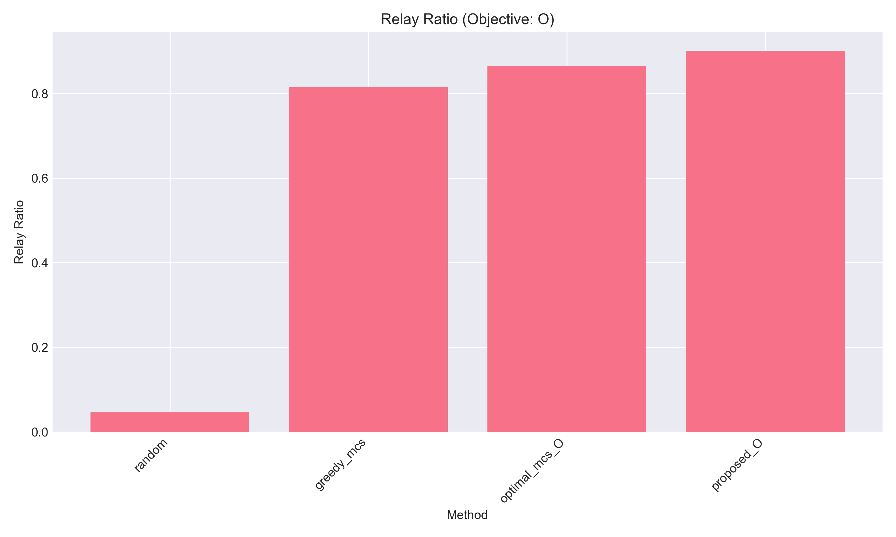

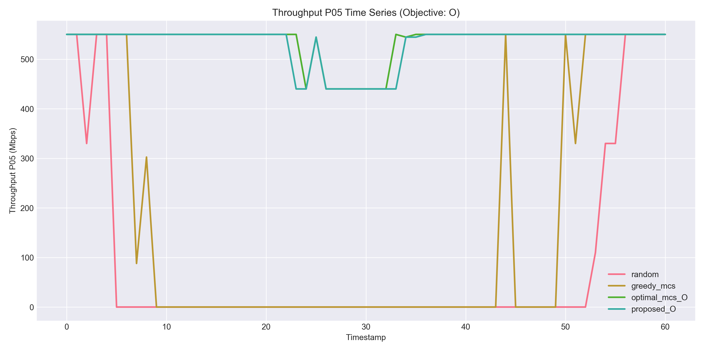

## 考察
1) **Optimal MCSが上界として機能**
   - MCS評価に整合する最適解を導入することで、Proposedが「最適」を超える見かけの問題が解消された。
   - Proposedは最適解とほぼ同等の性能で、わずかな差はD/Kマージンによる保守性と解釈できる。

2) **Greedy改善の効果と限界**
   - グローバルGreedyで大幅な改善は得られたが、依然としてOutageが残る。
   - ILPはRelayグループ活用を含めた全体最適化を行うため、Greedyとの性能差が明確。

3) **O目的の差が小さい理由**
   - 本シナリオではRelay経路が豊富で、T目的でも全車両救済が可能。
   - そのためO目的は「選択の微調整（Relay率増加）」に留まり、平均スループットはほぼ同一。

4) **スループットの上限**
   - P05/P50/P95が550 Mbpsに張り付いており、MCSテーブル上の上限（100 MHz帯域）が支配的。
   - 実環境での差異を強調するには、帯域・干渉・Relay容量制約などの追加が有効。

## 参考図（トレードオフ）
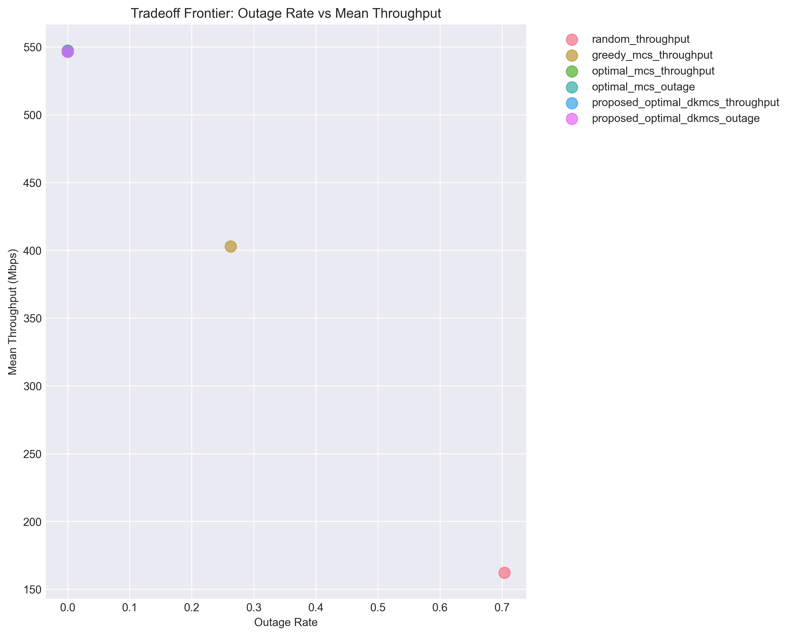

---
この文書は corner_intersection シナリオ（3BS, C_b=10）の出力結果に基づく。
